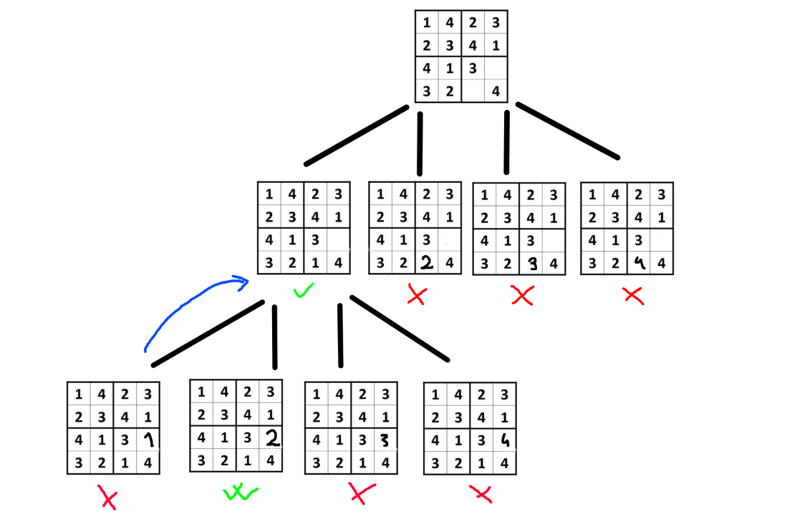

# Sudoku Solver with Backtracking Algorithm

This project implements a **Sudoku Solver** in **C**, which solves n<sup>2</sup> x n<sup>2</sup> Sudoku puzzles using the **Backtracking Algorithm**. The project also utilizes a **tree structure** to manage the backtracking process. This document explains the solver’s functionality, tree structure, and the project's structure in detail.

## Table of Contents

- [Introduction](#introduction)
- [How It Works](#how-it-works)
- [Tree Structure](#tree-structure)
- [Project Structure](#project-structure)
- [Installation](#installation)

---

## Introduction

Sudoku is a puzzle where you must fill a n<sup>2</sup> x n<sup>2</sup> grid with digits so that each column, each row, and each of the n<sup>2</sup> n x n subgrids contains all the digits from 1 to n. This project uses **backtracking** to solve the puzzle, and a **n-ary tree structure** is applied to track the recursive solving process.

---

## How It Works

### Backtracking Algorithm

The Sudoku solver is implemented using the **backtracking** technique. Backtracking is a trial-and-error method where each empty cell in the Sudoku grid is filled with a potential solution (a digit between 1 and n). If a number placement is valid, the algorithm recursively proceeds to solve the rest of the grid. If no solution can be found from the current configuration, it **backtracks** to try other possibilities.

### Algorithm Steps

1. **Locate an empty cell** in the Sudoku grid.
2. Try placing numbers from **1 to n** in that cell.
3. For each number:
   - Ensure the number follows Sudoku rules (no repetition in rows, columns, or nxn grids).
4. If a valid number is found:
   - Recursively try to solve the puzzle with the updated grid.
5. If no valid number can be placed, **backtrack** by resetting the current cell and trying the next number.

If a solution is found, the algorithm terminates successfully. Otherwise, it will report that no solution exists.

---

## Tree Structure

### Overview

The **tree structure** used in the solver tracks the decision-making process during backtracking. Each node in the tree represents a step in the solution process, with child nodes corresponding to potential choices for the next empty cell.

### How the Tree structure Works

1. **Nodes**:
   - Each **node** represents a state of the Sudoku grid after placing a number in one of the cells.
   - A node stores information about the current grid configuration, the row and column being filled, and the number placed.

2. **Edges**:
   - An **edge** connects a node to a child node, representing the decision to place a particular number in the current cell.

3. **Backtracking as Traversal**:
   - The process of **traversing the tree** is equivalent to trying different numbers in each cell.
   - When a placement leads to a dead-end (no valid moves), the algorithm **backtracks** to the parent node, removing the edge and trying other potential child nodes.

### Tree Traversal (Backtracking)

- The tree is traversed depth-first (DFS style), where each recursive call represents moving deeper into the tree.
- If the algorithm finds a valid number, it creates a child node and proceeds to the next cell.
- If all child nodes lead to dead ends, the algorithm backtracks by returning to the previous node and trying different numbers in the previous cell.
  
This recursive tree-based approach allows the algorithm to explore all possibilities and efficiently find the solution.



---

## Project Structure

```bash
├── game.h             # Header file containing function declarations
├── game.c             # Source file with Sudoku solver logic and tree functions
├── main.c             # Main file to handle user input and run the solver
└── README.md          # Documentation (this file)
```

## Installation
1. **Clone the repository**:
   ```bash
   git clone https://github.com/bonkooo/sudokutree.git
   ```
2. **Navigate to the project directory:**:
   ```bash
   cd sudokutree
   ```
3. **Compile the code:**:
   ```bash
   gcc -o sudokutree main.c game.c
   ```
4. **Run the .exe file:**:
   ```bash
   sudokutree.exe
   ```

   
